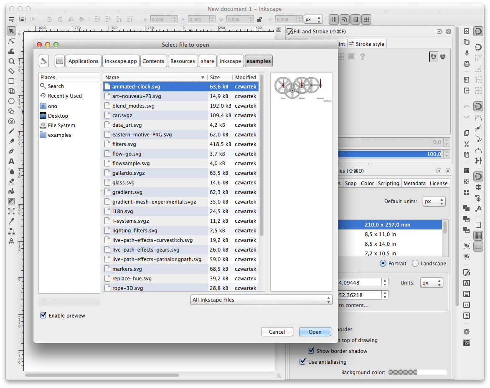

# Mac theme for GTK 2.0

[Gnome-Cupertino]: http://gnome-look.org/content/show.php/Gnome+Cupertino?content=147061
[Faience-Azur]: https://code.google.com/p/faience-theme/downloads/detail?name=faience-icon-theme_0.5.zip&can=2&q=

Purpose of this theme is to make *Inkscape* native build integrate seamlessly
with latest OSX.

This theme is based on [Gnome-Cupertino][Gnome-Cupertino] by *Rafa Cobreros*.

### Changes to original theme

1. Checkbox and radio buttons were remade in SVG (for *Retina* support)
2. Button & combo box gradients were adjusted to match better *10.9*
3. Removed GTK 3.0 theme and 3rd party app fixes

### Screenshot

Icon set presented on this set is [Faience-Azur][Faience-Azur]. *Inkscape*
icons are adjusted [Symbolic Icons](icons/icons.svgz).

### License

This theme is released under [GNU GPL license](LICENSE).
